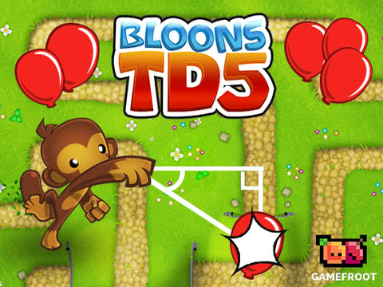

## Bring Your Kid(s) to Work Day Coding Rooms
### Hosted by Seattle CoderDojo and Amazon.com

Thanks for joining us. Our volunteers are here to help you get started and help you when you run into problems you can't figure out. Parents are encouraged to help their children through the tutorials.

## PICK A TUTORIAL

<table border="0" padding="0">
    <thead>
        <tr>
            <th colspan="2"><h3>Pre-Readers</h3> Create programs using symbols.</th>
        </tr>
    </thead>
    <tbody>
        <tr>
            <td align="center"><a href="http://lightbot.com/hour-of-code.html"> Lightbot</a></td>
            <td align="center"><a href="https://hourofcode.com/bits"> Lego&trade; Bits & Bricks</a></td>
        </tr>
    </tbody>
</table>

<table border="0" padding="0">
    <thead>
        <tr>
            <th colspan="2"><h3>Elementary School</h3> Create programs using drag-and-drop instruction blocks.</th>
        </tr>
    </thead>
    <tbody>
        <tr>
            <td align="center"><a href="https://code.org/minecraft"> Minecraft Adventures</a></td>
            <td align="center"><a href="https://code.org/starwars"> Star Wars: Building a Galaxy</a></td>
        </tr>
    </tbody>
</table>

<table border="0" padding="0">
    <thead>
        <tr>
            <th colspan="2"><h3>Middle School</h3> Start writing some code.</th>
        </tr>
    </thead>
    <tbody>
        <tr>
            <td align="center"><a href="https://hourofcode.com/globaloria"> Make Quest</a></td>
            <td align="center"><a href="https://hourofcode.com/cocom"> Code Combat</a></td>
        </tr>
    </tbody>
</table>

<table border="0" padding="0">
    <thead>
        <tr>
            <th colspan="2"><h3>High School</h3> Maybe you can handle something a bit more difficult.</th>
        </tr>
    </thead>
    <tbody>
        <tr>
            <td align="center"><a href="https://hourofcode.com/applabintro"> Intro to App Lab</a></td>
            <td align="center"><a href="http://bit.ly/hocalexa"> Build an Alexa Skill</a></td>
        </tr>
    </tbody>
</table>
<table border="0" padding="0">
    <thead>
        <tr>
            <th colspan="2"><h3>Secret Menu</h3> If you think you're too advanced for all the ones above, figure out how to show the secret menu for three harder options.</th>
        </tr>
    </thead>
<!--    <tbody>
        <tr>
            <td align="center"><a href="https://hourofcode.com/thinkfun"> Robot Repair</a> Why not try some Boolean logic puzzles on for size?</td>
            <td align="center"><a href="https://www.codingame.com/hour-of-code"> Coders Strike Back</a> Write code to guide racing rockets around increasingly hard courses.</td>
        </tr>
        <tr>
            <td colspan=2 align=center><a href="https://hourofcode.com/gfbloons"> Bloons Triginometry Defense</a> Enlist advanced math skills in this popular tower defense game.</td>
        </tr>
    </tbody> -->
</table>

